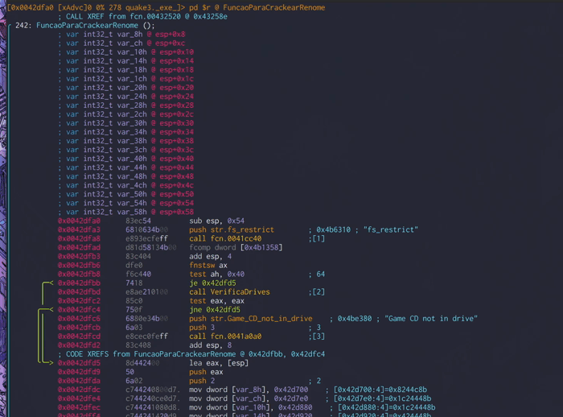

# Introdução ao *radare2*: descobrindo *Quake 3 Arena*

Há mais de 20 anos, **Quake III Arena** foi lançado pela empresa **idSoftware**; em 1999, eu, ainda garoto (e não o tiozão de hoje), peguei em minhas mãos uma cópia original de um dos *melhores* jogos das últimas décadas. Na época comprar um jogo original, assim como hoje, não era acessível para um garoto de 14 anos, mas ainda sim, valei-me da cópia: a caixa de **Quake 3**, com detalhes em alto relevo, um manual extenso, e o CD com fundo translúcido e espelhado. Estes são detalhes (e valores!) que, para a época, se assemelham a aquisição de um jogo de última geração, atualmente.

Naquele tempo, os *FPS (First Person Shooter)* estavam tomando uma proporção cada vez maior e popularizando os jogos em primeira pessoa. **Unreal Tournament** havia sido lançado naquele mesmo ano, enquanto **Counter Strike** seria lançado no ano seguinte, como uma modificação do jogo **Half Life**. *Ahh, Half Life!* Eis aí algo que joguei, e joguei, e joguei repetidas vezes (assim como toda a serie **Quake**), para então, substituí-lo pela *mod Counter Strike*. 

Para os desavisados e mais novos: a Internet da época nem se compara a de hoje, bem trivial dizer isso, mas pense que operávamos com velocidades de pouquíssimas dezenas de *kilobytes* por segundo, por isso, jogar em rede, era uma odisséia de paciência, não havia preços acessíveis para Internet rápida. A melhor alternativa para mim, e para meus amigos, era simples: para jogarmos em rede, com uma latência muito baixa, por quê não criarmos nossa própria rede de computadores?

Em feriados e período de férias escolares, nos reuníamos e levávamos os nossos computadores, com todos os nossos CDs de instalação, CDs de jogos e tralhas e mais tralhas, para a casa de um dos que fariam parte da *"rede"* (azarado ou maluco?), juntávamos tudo e nos conectávamos a nossa rede interna. O engraçado é que entre 8 a 10 computadores ligados em rede, dividíamos tudo, como se fosse uma *pré-Campus Party*. Entre tantos *nerds*, eu e mais um, éramos os únicos que utilizávamos **Linux**, com *Slackware* e *Debian*, discutindo qual era o melhor (Slackware, *óbvio!, cof!, cof!*). Agora, imagine você, lá pelos anos 2000 ter que configurar uma rede interna com conexão a outros computadores, sem acesso a Internet? A solução era utilizar o "computador da casa", geralmente da mãe ou do pai do maluco que nos hospedava, e assim resolver o conflito na rede. 

Dentre os vários e vários jogos da nossa lista, estavam toda a serie, **Diablo** e **Diablo 2**, **Age of Empires**, **Neverwinter Nights**, entre outros poucos mais. Com tantos jogos assim, a normalidade era piratear: não utilizávamos os CDs originais, pois ninguém tinha grana o suficiente para isso. A Internet já era uma dificuldade (e crise na adolescência) pelo valor mensal, os jogos *então*... Para lembrar, cada jogo custava em média R$70/ R$80, em tempos que isso era, sim, parte significativa do orçamento familiar. Por essa época, compartilhávamos, também, os *cracks*, que era a forma que nos possibilitava jogar, sem possuir o *software* original.

Depois de toda essa introdução, sem muita conexão com o objetivo do texto, vamos para a parte que criaremos nosso próprio binário modificado, o **crack**.

## *Crackeando* Quake 3

Mas peraí... qual a relevância em *"crackear"* um jogo com mais de duas décadas? Nenhuma, oras! Não haverá lucro, tão pouco proveito em *piratear* o *software*. Hoje, 2020, a **idSoftware** disponibilizou todo o código-fonte do jogo em seu [Github](https://github.com/id-Software/Quake-III-Arena), e quem quiser alterá-lo ou adaptá-lo, basta baixar. A importância deste texto é: aprender **radare2** e compreender como as coisas mudaram na estrutura dos *softwares*.

O objetivo deste texto, mais um entre as várias publicações sobre o **radare** por aqui, é aprender, na prática, os comandos e caminhos para alterar um executável. Para facilitar e comparar, temos acesso hoje ao código-fonte do *FPS* que, no final (e somente no final!), daremos uma espiada. Por isso, sem *spoilers* e vamos à prática.

O arquivo binário original e sem modificações, `quake3._exe_`, com o qual iremos trabalhar neste texto, está compactado e disponível [neste link para download](https://github.com/deniszanin/deniszanin.github.io/raw/master/_posts/files/r2-bin-q3.zip). Este arquivo, quando descompactado, possui as seguintes "assinaturas" *(hashes)*:

```
SHA1: 268e21c477097ccc4db704a089db18b92bfe8af9
SHA256: e77bb95456dacd0063b24d5f938dfcd99537f1a0110f564c341013735ce70083
```

A verificação das "assinaturas" é um hábito de extrema importância, em todas as circunstâncias, pois nos certificamos que o arquivo baixado não sofreu alterações durante o download (não sofreu alterações por terceiros), e temos certeza que o arquivo é exatamente o mesmo com o qual trabalharemos. A autenticidade do arquivo é confirmada. Durante o texto aprenderemos como verificar estas *hashes* pela ferramenta `radare2`. Paciência, *jovem padawan*!

## O conjunto de ferramentas *radare2*

### Sobre a instalação do *radare2*

Para facilitar as nossas vidas, está publicado aqui no *blog*, no texto [](), os caminhos e procedimentos para a instalação do **radare2** em todos os sistemas operacionais, por isso não vou cobrir a instalação neste texto. Assim como nesse texto introdutório, a redação do texto sobre a instalação da ferramenta foi feita com todo o carinho e cuidado. Para levar a sério as novas funcionalidades e atualizações feitas pela comunidade no **Github**, é muito importante que o programa seja instalado manualmente, como descrevi, e não via `apt-get`/`dnf`/`yum` da vida... Existem diversas distribuições de Linux, com seus *package managers*, que demoram meses para atualizar seus repositórios. 

> *-- Follow the white rabbit*

### Introdução e a *interface* do *radare2*

É importante atentar que o __radare2__ é um conjunto de ferramentas, com diferentes e diversos usos. O comando `radare2` é a *principal* ferramenta deste conjunto e sobre o qual a análise de arquivos binários será feita. Esta análise será sempre realizada pela linha de comando (diferente de outros programas conhecidos, como ***IDA***, ***Ghidra***, ***Hopper***, e ***Binary Ninja*** que possuem *apenas* a ferramenta gráfica). Embora o __radare2__ também possua uma ferramenta gráfica para analisar binários, seu uso é direto e simples. O projeto, chamado de ***Cutter***, está em desenvolvimento e ainda possui alguns *bugs*; o projeto é multiplataforma e está [disponível no Github](https://github.com/radareorg/cutter). Desta forma, iniciamos nosso ambiente de trabalho, pela *shell*, com o comando `radare2`, ou melhor, vamos utilizar o comando `r2`, um *link* simbólico para o binário `radare2`.

```sh
$ r2 -w quake3._exe_
```

Simples assim: executado o comando `r2` com o argumento `quake3._exe_`, o `radare2` será aberto, rapidamente, em modo de leitura e gravação (especificado com a opção `-w`, o **write mode**) e o arquivo binário `quake3._exe_` não será completamente analisado até solicitarmos tal ação, com outro comando (dentro da linha de comando do próprio `r2`, veremos mais detalhes sobre o comando `aaa` em breve). Após a execução de `r2 -w quake3._exe_`, o retorno será algo *parecido* com:

```sh
$ r2 -w quake3._exe_
 -- This is not a joke.
[0x004a07c3]> 
```

O retorno será *parecido*, pois a primeira linha de retorno no exemplo, *"-- This is not a joke."*, trata-se de uma frase aleatória (chamadas de *fortunes*) que será diferente a cada acesso ao programa (com várias piadas, inclusive!); a segunda, a linha de comando do `r2`, por onde iremos interagir. A linha de comando interativa estará sempre representada com o **endereço offset**, entre colchetes, e o sinal `>`.

```sh
[POSIÇÃO_ATUAL_NO_BINARIO]> digite_aqui o comando_do_r2
```

Para mais frases aleatórias, as *fortunes*, experimente digitar `fo`.

```sh
[0x004a07c3]> fo
 -- Follow the white rabbit
[0x004a07c3]> fo
 -- You are a strange creature
```

O *endereço* entre colchetes no exemplo, `[0x004a07c3]`, é o endereço *offset* de entrada do binário, `quake3._exe_`. Também chamado de **entrypoint**, nos indica a posição de início da execução do binário. Podemos verificar e confirmar esta informação através de um comando muito simples, o primeiro comando que executaremos na ferramenta: `ie`. 

```sh
[0x004a07c3]> ie
[Entrypoints]
vaddr=0x004a07c3 paddr=0x000a07c3 haddr=0x00000118 type=program

1 entrypoints
```

E, sim...! A primeira dúvida que me surgiu quando estava descobrindo a *interface* do *radare2*, foi: mas como eu sei qual comando realizará determinada ação? Como descobrir os comandos disponíveis? Preciso decorar tudo? Na verdade, sim e não. O aprendizado será o mesmo para a linha de comando no ambiente **unix**: na prática! Sempre com a prática e com seu uso constante, aprenderemos os comandos. Há um truque, no entanto: experimente acrescentar, agora, um ponto de interrogação ao final do comando, `ie`: `ie?` para exibir a descrição deste comando e também de outros comandos iniciados com as letras `ie`.

```sh
[0x004a07c3]> ie?
| ie                 Entrypoint
| iee                Show Entry and Exit (preinit, init and fini)
```

Certo? Pois bem, na linha de comando do `r2`, digitaremos diversos comandos para cada necessidade: informações sobre o arquivo aberto, exibição de *bytes* e *hexadecimais*, exibição do conteúdo na memória em *debug*, montar gráficos, alterar *opcodes*, etc. 

Em sua primeira visita ao `r2`, é possível ficar *muito* perdido em meio a tantas opções (algo que espanta muitos e muitos usuários curiosos), mas existe uma forma de detalhar os comandos. Este pedido de ajuda é o comando `?`. Quando digitamos apenas `?`, o `r2` nos listará todos os comandos disponíveis na ferramenta (uma pequena prévia abaixo). 

```sh
[0x004a07c3]> ?
Usage: [.][times][cmd][~grep][@[@iter]addr!size][|>pipe] ; ...   
Append '?' to any char command to get detailed help
Prefix with number to repeat command N times (f.ex: 3x)
| ...
| ...
| g[?] [arg]              generate shellcodes with r_egg
| i[?] [file]             get info about opened file from r_bin
| k[?] [sdb-query]        run sdb-query. see k? for help, 'k *', 'k **' ...
| ...
```

Repare que para cada ação disponível na ferramenta, os comandos são iniciados por apenas uma letra: `a`, para **a**nálise; `b`, para o tamanho do **b**loco; e assim por diante (o alfabeto inteiro, *literalmente*). No caso do `i`, destacado na prévia acima, o `r2` nos indica que servirá para obter informações sobre o arquivo aberto: `i[?] [file]: get info about opened file from r_bin`. Para mais detalhes sobre este comando, digitamos `i`, seguido pelo ponto de interrogação: `i?`, que nos exibirá outra lista de comandos possíveis, dentro da ação da letra `i`, de informações.

```sh
[0x004a07c3]> i?
Usage: i   Get info from opened file (see rabin2 s manpage)
| ...
| ...
| ...
| iD lang sym        demangle symbolname for given language
| ie                 Entrypoint
| iee                Show Entry and Exit (preinit, init and fini)
| iE                 Exports (global symbols)
| ...
| it                 File hashes
| iT                 File signature
| iV                 Display file version info
| ...
```

Quando digitamos `ie`, a *interface* nos retornou as informações sobre o *entrypoint* do arquivo binário, certo? Sendo assim, para fazer mais sentido na *decoreba* *nossa-de-cada-dia*, dos comandos, podemos pensar da seguinte maneira: **i**nformação do **e**ntrypoint, ou, `ie`! Mais fácil, não? Claro que essa não será uma regra, especialmente em nossa língua portuguesa diferindo da língua nativa do **r2**. 

Em outros comandos a analogia também irá funcionar: **i**nformação dos **i**mports, ou `ii`; **i**nformação dos **h**eaders, ou `ih`; **i**nformação dos **E**xports, ou, `iE`; em outras ações, no entanto, a correspondência entre letras não fará muito sentido: **i**nformação sobre o tamanho, em *bytes*, do binário, ou, `iZ`; **i**nformação sobre o binário, ou, `iI`. A alternativa para se lembrar de cada comando, é, de novo, a prática, *padawan*! 

Executaremos nosso segundo comando na ferramenta, `iI`, para obter **i**nformações do arquivo *(nesse comando, para decorar, eu lembro de algo como "informação da Informação")*. 

```sh
[0x004a07c3]> iI
arch     x86
baddr    0x400000
binsz    864313
bintype  pe
bits     32
canary   false
retguard false
class    PE32
cmp.csum 0x000dc3b7
compiled Wed Nov 24 03:07:47 1999
crypto   false
dbg_file C:\quake3\SOURCE\code\Release\quake3.pdb
endian   little
havecode true
hdr.csum 0x00000000
guid     383B9CA72
laddr    0x0
lang     c
linenum  true
lsyms    true
machine  i386
maxopsz  16
minopsz  1
nx       false
os       windows
overlay  true
cc       cdecl
pcalign  0
pic      false
relocs   true
signed   false
sanitiz  false
static   false
stripped false
subsys   Windows GUI
va       true
```

O retorno de `iI`, a **i**nformação da **I**nformação, nos diz mais a respeito do binário: o executável foi desenvolvido em **linguagem C** para o sistema operacional *Microsoft Windows*, em arquitetura de **32 bits**. Estas informações já são conhecidas pois sabemos a origem e sobre o arquivo analisado. 

Ou melhor, não totalmente... lembra que comentei sobre a importância da verificação das assinaturas do arquivo baixado? 

Há um comando no `r2` que nos retornará a informação das *hashes* para conferirmos a autenticidade do binário. O comando é... que tal se arriscar e tentar descobrir, pelo comando de ajuda `?`, por conta própria? O termo, em inglês, é *file hashes*.

```sh
md5 07e06cd8d1f3397ee0a3f1ba07bafc99
sha1 268e21c477097ccc4db704a089db18b92bfe8af9
sha256 e77bb95456dacd0063b24d5f938dfcd99537f1a0110f564c341013735ce70083
```

### Descobrindo os caminhos para *crackear*

Para clarear os nossos objetivos (em *burlar* e *enganar* a verificação de autenticidade do jogo original), precisamos pensar sobre a limitação imposta pelos desenvolvedores neste *software* e o que buscamos no arquivo original: nosso objetivo é desativar a verificação imposta pelo executável original; ou seja, queremos que o jogo funcione, sem precisarmos inserir o CD na bandeja do *drive* (uh! essa sim é uma palavra antiga!). 

No caso do **Quake 3 Arena**, a limitação imposta pelos desenvolvedores é verificar se o CD está presente no *drive* e se esta mídia contém os arquivos necessários do jogo; somente será possível iniciarmos o jogo, se houver o CD do **Quake 3 Arena** na bandeja do *drive*. Não importa se este CD é o original ou uma cópia do original (em determinados *softwares* da época havia uma verificação que funcionava apenas com o CD original).

Para entendermos como essa verificação é realizada no arquivo, temos duas possibilidades: analisar cada função do arquivo `quake3._exe_` e investigar todo seu funcionamento (inclusive códigos que não nos serão utéis), ou, a mais inteligente e mais utilizada: buscarmos por palavras-chave - ou *strings!* - no arquivo `quake3._exe_`. Mas como?

#### A análise do binário

Até o momento, executamos poucos comandos e obtivemos informações sobre o arquivo `quake3._exe_`. 

Foram três comandos, certo? `ie`, para o **entrypoint**; `iI`, para informações sobre o binário; e `it`, para as *hashes*. No entanto, não *solicitamos* ao **r2**, até agora, que analisasse o arquivo binário por completo: *calls* (chamadas), funções, bibliotecas, *imports*, referências cruzadas, etc. Estas informações ainda não foram processadas e separadas pelo **radare2**. Enquanto outros programas (como os já citados, **IDA**, **Ghidra**, **Hopper** e **Binary Ninja**) realizam essa ação assim quando o arquivo é carregado na respectiva ferramenta, o **radare2**, não; **radare2** prioriza o fluxo de leitura e abertura do arquivo, para que seja rápido. E de uma forma muito inteligente...

A estrutura do __radare2__ nos possibilita controlar se a análise e investigação do código de um binário será, ***em termos simples***, superficial, parcial ou completa. Esta ação é bem complexa, por isso separei um *post* apenas para explicar sobre seu funcionamento e maiores detalhes sobre a forma de análise do **radare2**. 

Por enquanto, o comando que será utilizado, e executado várias vezes (e facilmente decorado por você), é o comando `aaa`.

```sh
[0x004a07c3]> aaa
[x] Analyze all flags starting with sym. and entry0 (aa)
[x] Analyze function calls (aac)
[x] Analyze len bytes of instructions for references (aar)
[x] Check for vtables
[x] Type matching analysis for all functions (aaft)
[x] Propagate noreturn information
[x] Use -AA or aaaa to perform additional experimental analysis.
```

Perceba que o comando `aaa` é, na verdade, um atalho para um fluxo inteiro de análise do arquivo: os comandos `aa`, `aac`, `aar` e `aaft` são executados, um após o outro. O comando `aa` é, por si só, a ação para a análise do binário; em alguns casos, a sua execução será o suficiente para *traduzir* todo o código do arquivo. Por se tratar de um arquivo pequeno, com *865kb*, vamos utilizar a análise parcial, o comando `aaa`. Agora, podemos cruzar referências, *disassemblar* funções, e muitas outras ações mais complexas.

Pois bem, com a varredura do código realizada, podemos voltar para a busca das *strings*.

#### Buscando por *strings* e funções

Antigamente, quando a mídia não estava presente no *drive*, era *quase* padrão que o *software* nos apresentasse uma mensagem de erro, como: *"Por favor, insira o CD para continuar..."*, ou, *"CD do jogo não está no drive"*. Entre essas mensagens, podemos reparar palavras-chave que aparecem igualmente entre as frases. E é exatamente a palavra ***"CD"*** que procuramos nas *strings* do executável.

Para buscarmos por *strings*, o `r2` oferece as seguintes opções em seu menu de ajuda de informações (`i?`):

```sh
| ...
| iz|izj             Strings in data sections (in JSON/Base64)
| izz                Search for Strings in the whole binary
| izzz               Dump Strings from whole binary to r2 shell (for huge files)
| iz- [addr]         Purge string via bin.str.purge
| ...
```

O comando `i`, apenas, significa obter **i**nformações sobre o arquivo em questão, como já foi dito, certo? Por isso, não perderemos tempo, e vamos direto ao comando `iz`, que nos exibirá as *strings* da seção **data** do arquivo.

```sh
[0x004a07c3]> iz
Do you want to print 4264 lines? (y/N) 
```

*Pausa!* Queremos exibir 4.264 linhas e procurar nossa palavra-chave uma por uma? Ah, definitivamente não! Não e não, não queremos olhar 4.264 linhas de *strings* à busca da nossa palavra-chave *"CD"*. Mas, e se filtramos toda essa listagem com um comando `grep`? Seria ótimo, não?! No **radare2**, o conhecido comando `grep` pode ser concatenado na última linha de comando `iz`. Seu uso é um pouco diferente, e representado com o símbolo **til**, ou `~`. Veja no *menu* de ajuda.

```sh
[0x004a07c3]> ?
Usage: [.][times][cmd][~grep][@[@iter]addr!size][|>pipe]
| ...
| ...
| ...
```

Desta forma, para filtrar todo o retorno do comando `iz`, de forma a exibir apenas as *strings* contendo nossa palavra-chave, **CD**, acrescente o `~` ao final do comando `iz` e em seguida, a palavra-chave.

```sh
[0x004a07c3]> iz~CD
508  0x000b7db4 0x004b7db4 22  23   .data   ascii   Server didn't have CD\n
1054 0x000be380 0x004be380 20  21   .data   ascii   Game CD not in drive
1099 0x000be6fc 0x004be6fc 35  36   .data   ascii   print\nSomeone is using this CD Key\n
1100 0x000be720 0x004be720 36  37   .data   ascii   print\nAwaiting CD key authorization\n
3003 0x000c92a0 0x004c92a0 16  17   .data   ascii   ...calling CDS: 
3005 0x000c92d4 0x004c92d4 46  47   .data   ascii   ...already fullscreen, avoiding redundant CDS\n
3032 0x000c9734 0x004c9734 26  27   .data   ascii   ...MCD acceleration found\n
```

E pronto! Com o uso do `~` (o ***grep*** interno do __radare2__), o comando `iz` funcionou e nos retornou apenas 7 das 4.264 linhas de antes. Todas as linhas contendo a palavra-chave que buscamos. Relendo cada uma delas, observamos a segunda *string*, ***"Game CD not in drive"***, tradução para *"O CD do jogo não está no drive"*: encontramos uma possível mensagem de erro para quando o CD não estiver presente, juntamente com a sua localização no binário.

Na listagem acima, o programa exibe o endereço `0x004be380` (terceira coluna) para a *string* que buscamos. Esta é a localização da *string* no binário. Podemos, então, *ir* para o ponto, do binário, onde essa mensagem está *presente*. Na verdade, não precisamos *ir* até este ponto do binário, podemos exibir/ imprimir (***p**rint*, em inglês) seu conteúdo na tela:

```sh
[0x004a07c3]> pd 1 @ 0x004be380
            ; DATA XREF from fcn.0042dfa0 @ 0x42dfc6
            ;-- str.Game_CD_not_in_drive:
            0x004be380     .string "Game CD not in drive" ; len=21
```

Este é mais outro comando para praticarmos (e muito!): `pd`. 

`pd`, decoremos como im**p**rimir **d**isassembly. O comando executado, `pd 1 @ 0x004be380`, retornou 1 instrução *disassemblada* no endereço `0x004be380`. 

A sintaxe deste comando será muito útil para nosso atual objetivo, `pd`, seguido pelo número de *instruções*, no endereço (*no endereço*, escrito pelo símbolo `@`), seguido pelo endereço que queremos: `pd numero_de_instruções @ endereco_para_exibir`. 

Mas atenção: existem dois comandos muito parecidos para imprimir o *disassembly*, `pd` e `pD`. A sintaxe será *quase* a mesma, a diferença entre eles está no primeiro argumento: número de *instruções* para o número de *bytes*, no caso de `pD`. E está descrita no menu de ajuda, da letra `p`, de im**p**rimir.

```sh
[0x004a07c3]> pd?
Usage: p[dD][ajbrfils] [len]   # Print Disassembly
│ ...
| pD N             disassemble N bytes
| pd -N            disassemble N instructions backward
| pd N             disassemble N instructions
| pd--[n]          context disassembly of N instructions
│ ...
```

Como já analisamos o arquivo binário através do comando `aaa`, o **radare2** cruzou as referências presentes no código, e comentou parte do exemplo acima, `; DATA XREF from fcn.0042dfa0 @ 0x42dfc6`, indicando a referência onde a nossa *string* é *chamada*, no endereço `0x42dfc6`. Como a intenção deste texto é nos familiarizarmos com a *interface*, vamos executar outro comando para buscar por essa mesma informação de referência cruzada. `axt 0x004be380` retornará o local onde o endereço da nossa *string*, `0x004be380`, está sendo referenciado. 

```sh
[0x004a07c3]> axt 0x004be380
fcn.0042dfa0 0x42dfc6 [DATA] push str.Game_CD_not_in_drive
```

E eis que temos as referências: `fcn.0042dfa0` é o nome da função onde a *string* está sendo usada; `0x42dfc6`, o endereço, dentro da função, exatamente onde a instrução, `push str.Game_CD_not_in_drive`, está sendo usada. Podemos im**p**rimir o **d**isassembly para o endereço `0x42dfc6` para visualizarmos o seu código.

```sh
[0x004a07c3]> pd-- 8 @ 0x42dfc6
│           0x0042dfad      d81d58134b00   fcomp dword [0x4b1358]
│           0x0042dfb3      83c404         add esp, 4
│           0x0042dfb6      dfe0           fnstsw ax
│           0x0042dfb8      f6c440         test ah, 0x40               ; 64
│       ╭─< 0x0042dfbb      7418           je 0x42dfd5
│       │   0x0042dfbd      e8ae210100     call fcn.00440170
│       │   0x0042dfc2      85c0           test eax, eax
│      ╭──< 0x0042dfc4      750f           jne 0x42dfd5
│      ││   0x0042dfc6      6880e34b00     push str.Game_CD_not_in_drive ; 0x4be380 ; "Game CD not in drive"
│      ││   0x0042dfcb      6a03           push 3                      ; 3
│      ││   0x0042dfcd      e8cec0feff     call fcn.0041a0a0
│      ││   0x0042dfd2      83c408         add esp, 8
│      ││   ; CODE XREFS from fcn.0042dfa0 @ 0x42dfbb, 0x42dfc4
│      ╰╰─> 0x0042dfd5      8d442400       lea eax, [esp]
│           0x0042dfd9      50             push eax
│           0x0042dfda      6a02           push 2                      ; 2
│           0x0042dfdc      c744240800d7.  mov dword [var_8h], 0x42d700 ; [0x42d700:4]=0x8244c8b
```

E mais outro comando: `pd--`. Utilizamos, `pd--`, de uma maneira muito similar aos outros dois que vimos há pouco. 

Neste caso, queremos visualizar o contexto, de todo o código em volta do endereço `0x42dfc6`, onde está a *string*. Ou seja, instruções para cima da *string*, e para baixo do código da *string*. Apenas um comando para desempenhar o resultado de outros dois comandos que já conhecemos:

```sh
[0x004a07c3]> pd -8 @ 0x42dfc6
│           0x0042dfad      d81d58134b00   fcomp dword [0x4b1358]
│           0x0042dfb3      83c404         add esp, 4
│           0x0042dfb6      dfe0           fnstsw ax
│           0x0042dfb8      f6c440         test ah, 0x40               ; 64
│       ╭─< 0x0042dfbb      7418           je 0x42dfd5
│       │   0x0042dfbd      e8ae210100     call fcn.00440170
│       │   0x0042dfc2      85c0           test eax, eax
│      ╭──< 0x0042dfc4      750f           jne 0x42dfd5

[0x004a07c3]> pd 8 @ 0x42dfc6
│           0x0042dfc6      6880e34b00     push str.Game_CD_not_in_drive ; 0x4be380 ; "Game CD not in drive"
│           0x0042dfcb      6a03           push 3                      ; 3
│           0x0042dfcd      e8cec0feff     call fcn.0041a0a0
│           0x0042dfd2      83c408         add esp, 8
│           ; CODE XREFS from fcn.0042dfa0 @ 0x42dfbb, 0x42dfc4
│           0x0042dfd5      8d442400       lea eax, [esp]
│           0x0042dfd9      50             push eax
│           0x0042dfda      6a02           push 2                      ; 2
│           0x0042dfdc      c744240800d7.  mov dword [var_8h], 0x42d700 ; [0x42d700:4]=0x8244c8b
```

O objetivo é imprimir o que há em volta da referência da *string*, para buscarmos por alguma instrução interessante entre *jumps* e *calls*. O comando possui a sintaxe que já vimos: `pd-- numero_de_instruções_em_volta @ endereco`. A instrução da *string* está localizada no endereço `0x0042dfc6`, 8 instruções para cima chegamos no endereço `0x0042dfad`, 8 instruções para baixo no endereço `0x0042dfdc`.

#### Avançando pelas funções do binário

Quando executamos o comando `axt 0x004be380`, o **r2** nos retornou, também, o nome de uma função: `fcn.0042dfa0`. É nesta função que está o trecho do código acima, junto com nossa *string*. Aprenderemos agora a alterar a nossa posição atual no binário, de uma localização para uma outra. Mas onde estamos, afinal?

Você se lembra que na linha de comando interativa do **r2** há um endereço? Agora, está indicando o endereço do **entrypoint** que comentei anteriormente. Esta é a nossa atual posição no binário; é neste ponto onde *o cursor está parado* e onde estamos *"trabalhando"*. O comando para exibir e alterar a posição atual é apenas a letra `s` (de *seek*, em inglês, mas sinceramente, para nossa *decoreba*, pense em ***s**iga para*). Este comando será muito utilizado por todo o **radare2**.

O comando `s` sozinho, sem argumentos, nos fornecerá a nossa posição atual no binário, e que será a mesma representada entre os colchetes da linha interativa. Mas que tal avançarmos esse *cursor* para a posição da função que o comando `axt` nos retornou?

```sh
[0x004a07c3]> s
0x4a07c3
[0x004a07c3]> s fcn.0042dfa0
[0x0042dfa0]>
```

Repare que o endereço na linha interativa mudou de `0x004a07c3`, para o atual endereço da função `fcn.0042dfa0`, em `0x0042dfa0`. 

Podemos agora usar um novo comando (mais uma novidade para a lista): *im**p**rimir* ***d**isassembly* da ***f**unção* onde o *cursor* está parado. O comando que será executado é o `pdf`, e não precisamos referenciar endereço algum como argumento; o __r2__ entenderá que o usuário deseja *im**p**rimir* ***d**isassembly* da ***f**unção* da posição atual.

```sh
[0x0042dfa0]> pdf
            ; CALL XREF from fcn.00432520 @ 0x43258e
╭ 242: fcn.0042dfa0 ();
│           ; var int32_t var_8h @ esp+0x8
│           ; var int32_t var_ch @ esp+0xc
│           ; var int32_t var_10h @ esp+0x10
│           ; var int32_t var_14h @ esp+0x14
│           ; var int32_t var_18h @ esp+0x18
│           ...
|			0x0042e074      c744245490da.  mov dword [var_54h], 0x42da90 ; [0x42da90:4]=440
│           0x0042e07c      c744245850db.  mov dword [var_58h], 0x42db50 ; [0x42db50:4]=0x4244c8b
│           0x0042e084      e837920400     call fcn.004772c0
│           0x0042e089      a390cd6600     mov dword [0x66cd90], eax   ; [0x66cd90:4]=0
│           0x0042e08e      83c45c         add esp, 0x5c
╰           0x0042e091      c3             ret
```

E *voilá*! A função onde a *string* é referenciada, aparece completa no seu *terminal*. 

Para mantermos o código organizado, vamos alterar o nome desta função, onde o *cursor* está parado, ou seja, a própria `fcn.0042dfa0`. Para alterar o nome de uma função é necessário que o *cursor* esteja posicionado corretamente. 

O comando para renomear uma função é `afn`, com o primeiro argumento sendo o novo nome:

```sh
[0x0042dfa0]> afn FuncaoPrimeira
```

Agora é possível buscar pela função renomeada e executar outros comandos no `r2` atualizados com o novo nome. Vamos repetir o exemplo anterior da busca por referências, e repare a diferença:

```sh
[0x0042dfa0]> axt 0x004be380
FuncaoPrimeira 0x42dfc6 [DATA] push str.Game_CD_not_in_drive
```

Bom, já que aprendemos a dinâmica de organização e visualização de funções, podemos voltar na análise do código exibido com o comando `pdf`, da função `FuncaoPrimeira`. Precisamos entendê-la (juntamente com seu código) para continuarmos com a quebra da verificação original. 

No seguinte trecho, analisaremos o código:

```sh
[0x0042dfa0]> pdf
│           ...
│           0x0042dfb8      f6c440         test ah, 0x40               ; 64
│       ╭─< 0x0042dfbb      7418           je 0x42dfd5
│       │   0x0042dfbd      e8ae210100     call fcn.00440170
│       │   0x0042dfc2      85c0           test eax, eax
│      ╭──< 0x0042dfc4      750f           jne 0x42dfd5
│      ││   0x0042dfc6      6880e34b00     push str.Game_CD_not_in_drive ; 0x4be380 ; "Game CD not in drive"
│      ││   0x0042dfcb      6a03           push 3                      ; 3
│      ││   0x0042dfcd      e8cec0feff     call fcn.0041a0a0
│      ││   0x0042dfd2      83c408         add esp, 8
│      ││   ; CODE XREFS from u_FuncaoStringCD @ 0x42dfbb, 0x42dfc4
│      ╰╰─> 0x0042dfd5      8d442400       lea eax, [esp]
│           0x0042dfd9      50             push eax
│           0x0042dfda      6a02           push 2 
│           ...
```

As setas do lado esquerdo indicam os *jumps* presentes no código *assembly*: a instrução `jne 0x42dfd5`, se executada, *levará* o usuário para além da localização de nossa *string* (*jump* para `0x42dfd5`), portanto, podemos imaginar que o retorno da função (anterior à instrução), `fcn.00440170`, será responsável pela validação do CD que procuramos. 

Se você, usuário experiente em **Assembly**, já analisou o código, deve ter reparado que neste ponto já poderíamos alterar o *opcode* da instrução `jne 0x42dfd5` e concluir a tarefa do texto. Já é possível alterar os *bytes* e criar nosso executável *crackeado*. 

Na próxima seção de texto, vamos analisar a função acima, para aprendermos outros comandos durante sua análise. Caso seu interesse seja outro, pule para a seção __"Alterando bytes e crackeando"__.

#### Função de verificação

Vamos a ela com o comando já visto, `s`, e para exibirmos seu conteúdo na tela, `pdf`:

```sh
[0x0042dfa0]> s fcn.00440170
[0x00440170]> pdf
╭ 163: fcn.00440170 ();
│           ; var int32_t var_4h_2 @ esp+0x2c
│           ; var int32_t var_4h @ esp+0x30
│           ; var int32_t var_5h @ esp+0x31
│           ; var int32_t var_6h @ esp+0x32
│           ; var int32_t var_7h @ esp+0x33
│           0x00440170      81ec84000000   sub esp, 0x84
│           0x00440176      56             push esi
│           0x00440177      8b3590104b00   mov esi, dword [sym.imp.KERNEL32.dll_GetDriveTypeA]
│           0x0044017d      c64424053a     mov byte [var_5h], 0x3a
│           0x00440182      c64424065c     mov byte [var_6h], 0x5c
│           0x00440187      c644240700     mov byte [var_7h], 0
│           0x0044018c      c644240463     mov byte [var_4h], 0x63
│           ...
```

Nossas suspeitas estão confirmadas: a função `fcn.00440170` realiza a busca e verificação do *drive*. 

Para mantermos o código organizado, vamos, mais uma vez, renomear a função.

```sh
[0x00440170]> afn VerificaDrives
```

Agora, com parte do código organizado, podemos nos concentrar na análise da função, começando pela seguinte instrução: `mov esi, dword [sym.imp.KERNEL32.dll_GetDriveTypeA]`. A função `GetDriveTypeA` está sendo *importada* da DLL **kernel32.dll**, que faz parte da biblioteca nativa do **Windows**. Em uma pesquisa rápida pela documentação da **API** do *Windows*, [disponível aqui em inglês](https://docs.microsoft.com/en-us/windows/win32/api/fileapi/nf-fileapi-getdrivetypea), encontramos uma descrição detalhada sobre esta função que foi *importada* da DLL. 

```
Sobre a função: determina se o drive é removível, fixo, CD-ROM, RAM, ou em rede.

Sintaxe:
	UINT GetDriveTypeA(
		LPCSTR lpRootPathName
	);

Parâmetros: o diretório raiz do drive.

Se o parâmetro for NULL, a função usa o diretório atual.

Valor de retorno: o valor de retorno diz o tipo de drive, sendo um dos seguintes valores:
	0: O tipo de drive não pode ser determinado.
	1. O caminho raiz é inválido.
	2: O drive é uma mídia removível.
	3: O drive é uma mídia fixa; por exemplo, um HD.
	4: O drive é um disco remoto (em rede).
	5: O disco é um drive de CD-ROM.
	6: O drive é a memória RAM.
```

E podemos confirmar no *assembly* da função `VerificaDrives`, o retorno esperado pelo programa:

```sh
[0x00440170]> pdf
│           ...
│           0x00440176      56             push esi
│           0x00440177      8b3590104b00   mov esi, dword [sym.imp.KERNEL32.dll_GetDriveTypeA]
│           ...
│           0x0044018c      c644240463     mov byte [var_4h], 0x63     ; 'c'
│       ╭─> 0x00440191      8d442404       lea eax, [var_4h]
│       ╎   0x00440195      50             push eax
│       ╎   0x00440196      ffd6           call esi
│       ╎   0x00440198      83f805         cmp eax, 5                  ; 5
│      ╭──< 0x0044019b      7548           jne 0x4401e5
```

Exatamente o que tínhamos imaginado! A instrução `cmp eax, 5` espera que a função `GetDriveTypeA` retorne o valor `5`, valor para o *drive* de CD-ROM, caso contrário (**jump not equal**, `jne`), o *jump* é realizado. Mas será que é apenas uma coincidência? Será que em algum outro lugar do binário a função `GetDriveTypeA` não está sendo também chamada? Pois bem, vamos procurar nos **imports** do binário, com o comando `ii`, ou **i**nformação dos **i**mports, concatenando-o com o `grep`.

```sh
[0x00440170]> ii~GetDriveTypeA
19  0x004b1090 NONE FUNC KERNEL32.dll GetDriveTypeA
```

E buscamos pelas referências cruzadas do endereço do *import*, da *DLL*.

```sh
[0x00440170]> axt 0x004b1090
 (nofunc) 0x4400c7 [DATA] mov esi, dword [sym.imp.KERNEL32.dll_GetDriveTypeA]
VerificaDrives 0x440177 [DATA] mov esi, dword [sym.imp.KERNEL32.dll_GetDriveTypeA]
(nofunc) 0x444216 [CODE] jmp dword [sym.imp.KERNEL32.dll_GetDriveTypeA]
fcn.004a0373 0x4a0392 [CALL] call dword [sym.imp.KERNEL32.dll_GetDriveTypeA]
```

Este foi apenas um outro exemplo de como utilizar os comandos `ii` e `axt`. Para evitar andar em círculos (e não terminar esse texto nunca!), eu já lhe adianto que as referências retornadas pelo comando `axt` não nos mostrarão nada de interessante. O importante é que estamos no caminho certo. Por isso, voltemos para a função `VerificaDrives`.

Com um pouco de conhecimento em linguagem *assembly*, podemos entender a estrutura da função: o algoritmo aloca o valor **0x63** na variável `var_4h`, que representa o carácter `c`, em ASCII; carregará, então, este valor em EAX, que será passado como parâmetro para a função `GetDriveTypeA`; se o retorno não for igual a `5` (CD-ROM), o algoritmo realizará o *jump* e continuará com algoritmo (estamos em um *loop* `for`), validando cada novo valor da variável `var_4h`, até `0x7a`, ou `z`, na tabela ASCII; caso nenhuma letra tenha correspondência com um *drive* do tipo *5*, CD-ROM, a mensagem de erro será exibida. Fácil, certo?

Como nossa intenção neste texto é aprender cada vez mais da *interface* do `r2`, vamos alterar o nome das variáveis e comentar as linhas que nos interessam para deixar o projeto ainda mais organizado.

O comando para renomear uma váriavel é o `afvn`; sua sintaxe é `afvn novo_nome_da_variavel antigo_nome_da_variavel`. Este comando é diferente do, já citado, `afn` para renomear funções. Para exemplificar, trocaremos o nome da variável `var_4h` por um nome que facilmente reconhecemos, `drive_letra`.

```sh
[0x00440170]> afvn drive_letra var_4h 
```

Para conferir se a variável foi renomeada, *im**p**rima* o ***d**isassembly* da ***f**unção* novamente, `pdf`.

Pois bem, renomeamos nossa função de verificação e uma variável. Em projetos maiores (e em outros programas!), é também muito comum adotarmos um *workflow* de *rascunho*, comentando cada linha do código para não precisarmos analisar (e reanalisar) cada linha. E como não seria diferente com o **radare2**, faremos isso. Existem, porém, duas formas para acrescentarmos comentários: a primeira, eu, sinceramente, **não recomendo e não utilizo**. Esta ação pode ser realizada com o seguinte comando e com a sintaxe: `CCu seu_comentario_aqui @ endereco_do_codigo`.

Neste primeiro exemplo, para comentarmos uma linha de código, como a da instrução `cmp eax, 5`, por exemplo, o comando seria `CCu Instrução para comparar o retorno da função "GetDriveTypeA", em EAX. @ 0x00440198`. E para remover o comentário, usamos o comando `CC- @ 0x00440198`.

O problema nesta primeira abordagem é que precisamos digitar o endereço, *offset*, de cada linha de código que quisermos comentar. E realizar essa ação, diariamente, é ridicularmente cansativa. Por isso, prefiro uma outra forma de visualização e edição de comentários.

#### Modo visual do ***radare2***

Prepare-se para entrar em um mundo completamente diferente da linha interativa: o modo visual do **radare2**.

O comando para *entrar* no modo **V**isual é o `V`, maiúsculo. Simples, não?

Mas atenção!: como eu disse, estamos entrando em um mundo diferente. Dentro deste modo, determinados comandos da linha interativa de antes, serão substituídos por teclas de atalhos que facilitarão o nosso trabalho. Pouco a pouco, as teclas de atalho terão vida dentro de você, *padawan*. 

Vamos a elas (as mais importantes, pelo menos): a mais importante, é a tecla `q`, que sairá do modo visual. Acredite! Essa tecla é *a mais importante*! O segundo atalho mais importante é a tecla `?`, para o menu de ajuda! Por quê não? A terceira mais utilizada é a `p`, para alternar entre os diferentes modos de visualização. Para movimentar a *tela*, utilize as setas do teclado ou (para usuários do editor de texto *VIm*), as teclas, `h`, `j`, `k`, `l`. Para acessar a linha de comando interativa do `r2`, utilize a tecla `:`. 

```sh
* PRINCIPAIS TECLAS DE ATALHO NO MODO VISUAL (V) *

  q 	- sair do modo visual/ sair do menu de ajuda
  ? 	- menu de ajuda
  p 	- alternar entre os modos de visualização
  : 	- acessar a linha de comando do r2
  ; 	- edição de comentários
  R 	- alternar entre cores (temas) do r2
  i 	- inserir/sobreescrever hexadecimal
  A 	- inserir/sobreescrever instrução assembly
  c 	- ativar/desativar modo de cursor

  h, j, k, l, setas do teclado		
  		- movimentar a tela e cursor
```

Ficou confuso? Tudo bem, experimente brincar com o modo visual... e repare em algo muito importante: a primeira linha da *interface*, neste modo, lá no topo do *terminal*, se assemelha a `[0x00440170 [Xadvc]0 0% 1488 quake3._exe_]> xc @ VerificaDrives`. Façamos um experimento: cada vez que pressionamos a tecla de atalho `p`, essa *barra de status* muda conforme o modo de visualização.

```sh
[0x00440170 [Xadvc]0 0% 1488 quake3._exe_]> xc @ VerificaDrives
[0x00440170 [xAdvc]0 0% 465  quake3._exe_]> pd $r @ VerificaDrives
[0x00440170 [xaDvc]0 0% 465  quake3._exe_]> diq;?0;f t.. @ VerificaDrives
[0x00440170 [xadVc]0 0% 2976 quake3._exe_]> prc @ VerificaDrives
[0x00440170 [xadvC]0 0% 2976 quake3._exe_]> pss @ VerificaDrives
```

O modo de visualização que queremos, no momento, é aquele que se assemelha ao retorno do comando `pdf`, executado anteriormente. Na *barra de status*, este modo será indicado na letra **A**. Com as teclas de movimentação, como uma barra de rolagem, podemos percorrer todo o código *assembly* desta função, e observar que o endereço na *barra de status* também é atualizado conforme percorremos o código. 

```sh
[0x00440170 [xAdvc]0 0% 465 quake3._exe_]> pd $r @ VerificaDrives
[0x00440176 [xAdvc]0 0% 465 quake3._exe_]> pd $r @ VerificaDrives+6  # 0x440176
[0x00440177 [xAdvc]0 0% 465 quake3._exe_]> pd $r @ VerificaDrives+6  # 0x440176
[0x0044017d [xAdvc]0 0% 465 quake3._exe_]> pd $r @ VerificaDrives+7  # 0x440177
[0x00440182 [xAdvc]0 0% 465 quake3._exe_]> pd $r @ VerificaDrives+13 # 0x44017d
[0x00440187 [xAdvc]0 0% 465 quake3._exe_]> pd $r @ VerificaDrives+18 # 0x440182
...
```

E continuamos com a movimentação pelo código, até alcançarmos a instrução `cmp eax, 5`, onde iremos acrescentar um comentário. Na *barra de status* a posição indica `@ VerificaDrives+40 # 0x440198`. Pressione a tecla de atalho `;` para acrescentarmos nosso comentário. Imediatamente a *interface* exibe o campo de preenchimento.

```sh
Enter a comment: ('-' to remove, '!' to use $EDITOR)
comment: Instrução para comparar o retorno da função "GetDriveTypeA", em EAX.
```

Você pode utilizar, também, um editor de texto para comentar as linhas de código; utilizo-o quando vejo que a instrução precisa de mais de uma linha de comentário. Para abrir o editor de texto, abra o menu de comentários com o atalho `;`, e em seguida, `!`. E para remover um comentário, digite `-` no campo de preenchimento.

Dica: caso queira alterar a configuração do **radare2** para usar o editor de texto de sua preferência, na linha de comando interativa do `r2`, defina a variável de configuração, com o comando `e cfg.editor=vi` ou `e cfg.editor=nano`.

Renomeações e comentários depois, um resultado exemplificado do meu projeto:

```sh
[0x00440170]> pdf
│           ...
│           0x00440176      56             push esi
│           0x00440177      8b3590104b00   mov esi, dword [sym.imp.KERNEL32.dll_GetDriveTypeA] ; Instrução para carregar a função "GetDriveTypeA".
│           ...
│           0x0044018c      c644240463     mov byte [drive_letra], 0x63 ; Instrução para definir o valor hexadecimal 0x63, 'c', a variável "drive_letra".
│       ╭─> 0x00440191      8d442404       lea eax, [drive_letra]
│       ╎   0x00440195      50             push eax                    ; Instrução para definir o primeiro argumento da função "GetDriveTypeA".
│       ╎   0x00440196      ffd6           call esi                    ; Instrução para executar a função "GetDriveTypeA". ; reloc.KERNEL32.dll_GetDriveTypeA
│       ╎   0x00440198      83f805         cmp eax, 5                  ; 5 
│       ╎   														   ; Instrução para comparar o retorno da função "GetDriveTypeA", em EAX, 
│       ╎   														   ; com o valor decimal 5. Quando relemos a documentação de "GetDriveTypeA",
│       ╎   														   ; e o retorno da função, entendemos que a instrução está esperando que a
│       ╎   														   ; letra do drive esperada, deve ser de um CD-ROM.
│      ╭──< 0x0044019b      7548           jne 0x4401e5                
│                                                                      ; Instrução para verificar o resultado da comparação acima;
│                                                                      ; se o retorno da função "GetDriveTypeA" não for igual a 5,
│                                                                      ; ou seja, o drive da variável "drive_letra" não for um CD-ROM.
│           ...
```

Acabamos de finalizar a análise da função `VerificaDrives`. No começo do texto eu havia comentado sobre o código-fonte do __Quake 3__, disponível no [Github](https://github.com/id-Software/Quake-III-Arena) da desenvolvedora, idSoftware. Por lá, encontramos, então, o código, em linguagem __C__, para a função original chamada de `Sys_ScanForCD`. Para efeito comparativo entre o *disassembly* e a linguagem __C__, um trecho da função original.

```c
#define	CD_BASEDIR	"quake3"
#define	CD_EXE		"quake3.exe"
#define	CD_BASEDIR_LINUX	"bin\\x86\\glibc-2.1"
#define	CD_EXE_LINUX "quake3"

...

drive[0] = 'c';
drive[1] = ':';
drive[2] = '\\';
drive[3] = 0;

// scan the drives
for ( drive[0] = 'c' ; drive[0] <= 'z' ; drive[0]++ ) {
	if ( GetDriveType (drive) != DRIVE_CDROM ) {
		continue;
	}

	sprintf (cddir, "%s%s", drive, CD_BASEDIR);
	sprintf (test, "%s\\%s", cddir, CD_EXE);
	
	f = fopen( test, "r" );
	
	if ( f ) {
		fclose (f);
		return qtrue;
	} else {
		sprintf(cddir, "%s%s", drive, CD_BASEDIR_LINUX);
		sprintf(test, "%s\\%s", cddir, CD_EXE_LINUX);
	
		f = fopen( test, "r" );
	
		if ( f ) {
			fclose (f);
	
			return qtrue;
		}
	}
}
```

Muito bem! E você continua por aqui, *padawan*? Parabéns, estamos *quase* concluindo...

#### Pausa para a organização do projeto

O código do arquivo `quake3._exe_` é simples, mas quando lidamos com diversos e diversos trechos de códigos, um projeto organizado salvará horas e horas de dores de cabeça. Vou propor, portanto, outra abordagem neste texto didático: não apenas mostrar como o **radare2** funciona, mas acostumar, você, usuário, a organizar pequenos e grandes projetos. O tópico não é muito comum entre textos sobre o **radare2**, e a informação não é muito disseminada, por isso achei importante acrescentar ao texto.

Uma das formas de salvar seu avanço na análise do arquivo `quake3._exe_` é criar um projeto e salvá-lo sempre, exatamente como fazemos em tantos outros programas. Suas análises, anotações, comentários, alterações, enfim!, todas ficarão salvas em um único arquivo compatível com o __radare2__. 

```sh
[0x0042dfa0]> Ps nome_do_projeto
nome_do_projeto
```

`Ps` é o comando para criar e/ou salvar seu projeto. Pela primeira vez, ou a cada alteração no binário, execute o comando `Ps nome_do_projeto` para salvá-lo. Para abrir um projeto salvo, utilizamos o comando `Po nome_do_projeto` na linha de comando interativa, ou ao abrir a ferramenta, `r2 -p nome_do_projeto`. Para listar todos os projetos salvos, no diretório padrão do __radare2__, execute `P`. E para visualizar as anotações do projeto aberto, `Pn` deve ser executado.

As anotações nos servirão como uma descrição sobre o projeto; para ajudar com nossa memória, tempos depois, podemos acrescentar essa descrição através do editor de texto configurado anteriormente.

```sh
[0x0042dfa0]> Pn -
```

E assim, manteremos todo o nosso fluxo de trabalho salvos em um único projeto.

#### Alterando *bytes* e *crackeando*

Agora, sim! Chegamos, por fim, no momento de modificar o binário `quake3._exe_` para *burlar* a verificação do CD original.

Para alcançarmos nosso objetivo, podemos *crackear* a função atual, `VerificaDrives`, mas, para fins didáticos, iremos nos focar apenas nos comandos da ferramenta, e apenas na primeira função que encontramos, `FuncaoPrimeira`. Por isso, voltaremos ao seu endereço.

```sh
[0x0042dfa0]> s FuncaoPrimeira

[0x0042dfa0]> pdf
│           ...
│           0x0042dfb8      f6c440         test ah, 0x40               ; 64
│       ╭─< 0x0042dfbb      7418           je 0x42dfd5
│       │   0x0042dfbd      e8ae210100     call VerificaDrives			; Instrução para chamar função de verificação dos drives.
│       │   0x0042dfc2      85c0           test eax, eax 				; Retorno da função é verificado.
│      ╭──< 0x0042dfc4      750f           jne 0x42dfd5 				; Instrução a ser crackeada, apenas jump condicional para jump.
│      ││   0x0042dfc6      6880e34b00     push str.Game_CD_not_in_drive ; 0x4be380 ; "Game CD not in drive"
│      ││   0x0042dfcb      6a03           push 3                      ; 3
│      ││   0x0042dfcd      e8cec0feff     call fcn.0041a0a0
│      ││   0x0042dfd2      83c408         add esp, 8
│      ││   ; CODE XREFS from u_FuncaoStringCD @ 0x42dfbb, 0x42dfc4
│      ╰╰─> 0x0042dfd5      8d442400       lea eax, [esp]
│           0x0042dfd9      50             push eax
│           0x0042dfda      6a02           push 2 
│           ...

```

Com a exibição da função `FuncaoPrimeira` e comentários, fica bem claro que modificaremos a instrução do endereço `0x0042dfc4`, alterando de um ***jump condicional*** para um ***jump***. E essa tarefa pode ser realizada de duas formas: alterando os *bytes* da instrução, ou digitando a *nova instrução* em *Assembly*.

```sh
[0x0042dfa0]> pd 1 @ 0x0042dfc4
│       ╭─< 0x0042dfc4      750f           jne 0x42dfd5
```

Duas formas diferentes, dois comandos diferentes, mesmo resultado: o primeiro comando para modificarmos o hexadecimal `75`, por `EB`, da instrução `jne 0x42dfd5`, é `wx eb @ 0x0042dfc4`. A alteração neste byte irá modificar a instrução: de `jne` para `jmp`, e desta forma *crackear* o executável do jogo.

```sh
[0x0042dfa0]> wx eb @ 0x0042dfc4

[0x0042dfa0]> pd 1 @ 0x0042dfc4
│       ╭─< 0x0042dfc4      eb0f           jmp 0x42dfd5
```

Outro jeito de *crackear* o binário é digitando a instrução completa, com o segundo comando `wa instrucao @ endereco`, que substituirá a instrução atual, do endereço `0x0042dfc4`. Como foi dito anteriormente, queremos alterar o *jump condicional* para um *jump*. Com este comando, dois *bytes* serão sobreescritos no binário, de acordo com o __radare2__. O resultado será o mesmo produzido pela alteração com o comando `wx`.

```sh
[0x0042dfa0]> wa jmp 0x42dfd5 @ 0x0042dfc4
Written 2 byte(s) (jmp 0x42dfd5) = wx eb0f

[0x0042dfa0]> pd 1 @ 0x0042dfc4
│       ╭─< 0x0042dfc4      eb0f           jmp 0x42dfd5
```

Todos estes comandos foram executados na linha interativa do __radare2__, certo? 

No entanto, a mesma tarefa também pode ser realizada pelo modo **V**isual, que aprendemos há pouco. Para isso, vá até o painel de exibição do *disassembly* (indicado pela letra *A*, na *barra de status*, lembra?), e pressione a tecla de atalho `c`, para ativar o modo *cursor*. 

Neste modo de movimentação, cada *byte* poderá ser percorrido com o *cursor*, usando as teclas de movimentação. Vamos, agora, *crackear* o binário também por aqui. Movimente o *cursor* até a *barra de status* indicar `[0x0042dfa0 *0x0042dfc4 [xAdvc]0 ($$+0x24)]> pd $r @ FuncaoPrimeira+36 # 0x42dfc4`, ou seja, até o endereço da instrução, o `0x42dfc4`. O bloco do *cursor* estará exatamente sobre o *byte* `0x75`. Nesta posição, pressionamos as teclas de atalho para as ações que executamos na linha interativa: para o comando `wx`, substituir o valor daquele *byte*, a tecla de atalho é `i`; para o comando `wa`, sobreescrever a instrução *Assembly*, a tecla de atalho é `A`.



Nos dois casos serão exibidos *prompts* para a digitação dos novos valores.

```
insert hex: eb
```

```
Enter assembler opcodes separated with ';':
:> jmp 0x42dfd5
```

Depois de confirmar os valores, e executar um, ou outro comando, repare que a instrução mudou de `jne 0x42dfd5` para `jmp 0x42dfd5`, exatamente como queríamos. Vamos salvar nosso projeto? `Ps`, caso já tenha esquecido. ;)

Concluímos, assim, nosso objetivo de *burlar* a verificação pelo CD original e criarmos nosso primeiro *crack*, usando o conjunto de ferramentas __radare2__.

### Material complementar no *YouTube*

Para complementar este texto, gravei um vídeo introdutório sobre o uso da ferramenta na análise do arquivo binário `quake3._exe`, exatamente como fizemos durante todo esse texto. O video [está disponível no YouTube e acessível clicando aqui](https://youtu.be/6n_Mird6LSw). Não vou anexar (*embed*) o material aqui no *blog* por uma questão de *privacidade* e *cookies de terceiros*. Para entender melhor, leia a seção __Sobre__ aqui do *blog*.

[](https://youtu.be/6n_Mird6LSw)

Não se esqueça de comentar por lá também! ;)

## Conclusão

Antes de sairmos da ferramenta, uma última ação: conferir a *assinatura digital* do executável `quake3._exe_` depois que a instrução foi modificada. Será que depois de alterarmos apenas um *byte* no binário as assinaturas mudaram? 

```sh
[0x0042dfa0]> it
File has been modified.
- md5 16eb6ef5754e28fd30790d9fc45eb780
+ md5 d26d3b4e8887741bf73091b5e2213768
- sha1 1af73ddc0892a8ef819f12a33b3c2c7a14819b25
+ sha1 5aa36b07e725ca556b038d7c5bf9fe8282571346
- sha256 b52a486c2374bc5de4e392c5061bf127cf56a78dde1b07d76b6c3d775df74983
+ sha256 7ac8e16d3da1b5d4f19487d088fe9dd06479349872580b5641088c949c836229
```

E *voilá*! Entendemos melhor a importância das *hashes* na confirmação da autenticidade de todo arquivo baixado na Internet; com apenas um *byte* modificado, todas as assinaturas mudaram completamente.

Por fim, vamos sair do __r2__.

```sh
[0x0042dfa0]> q
```

Está com alguma dúvida? Encontrou algum *bug*? Perguntas e comentários são sempre bem-vindos. No próximo *post* sobre o __radare2__, vamos aprender a analisar o algoritmo de validação de uma __CD-KEY__ e a criar um gerador de *CD-KEY* com base nesse mesmo algoritmo encontrado. O arquivo que será analisado também é de um *game* famoso da época, mas evitarei *spoilers* do próximo capítulo.

E fim! ;-)
